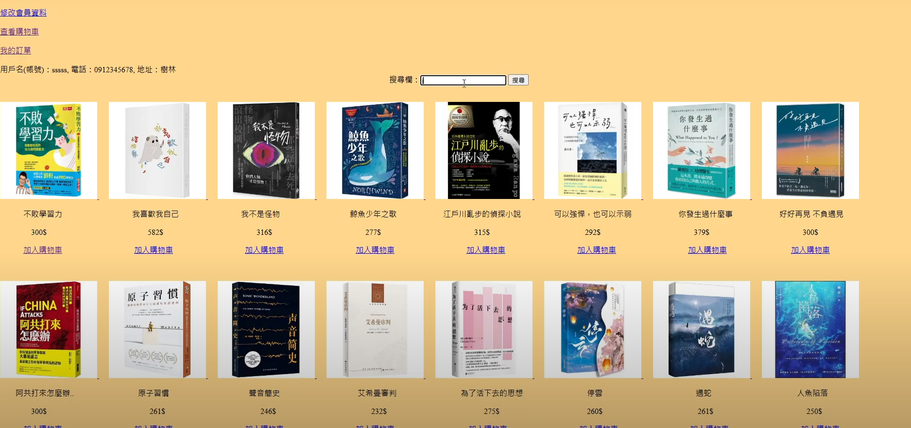
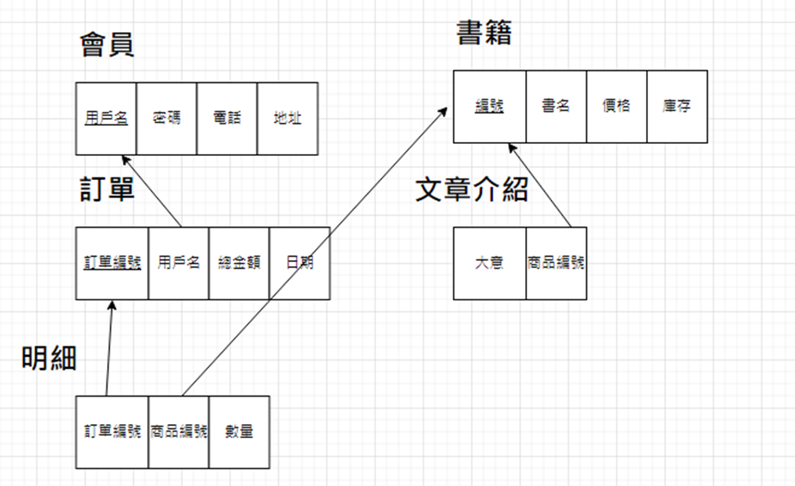

# PHP 簡易購物網站

## 專案簡介 Project Overview

這是一個以 PHP 與 MySQL/MariaDB 為基礎的簡易購物網站。  
目標是練習會員登入、購物車、書籍瀏覽與訂單送出等功能的實作。

## 主要功能 Core Features

- 會員註冊與登入登出  
- 書籍瀏覽與搜尋  
- 購物車管理  
- 訂單送出
- 歷史訂單查詢

## ERD

## 技術架構 Tech Stack

- PHP
- HTML , CSS
- MariaDB 
- Apache (XAMPP)  

## 🎬 Demo Video

[👉 Watch the demo video here](https://youtu.be/_cxM8Sjr8PY)
<iframe width="560" height="315" src="[https://www.youtube.com/embed/影片ID](https://youtu.be/_cxM8Sjr8PY)" frameborder="0" allowfullscreen></iframe>

